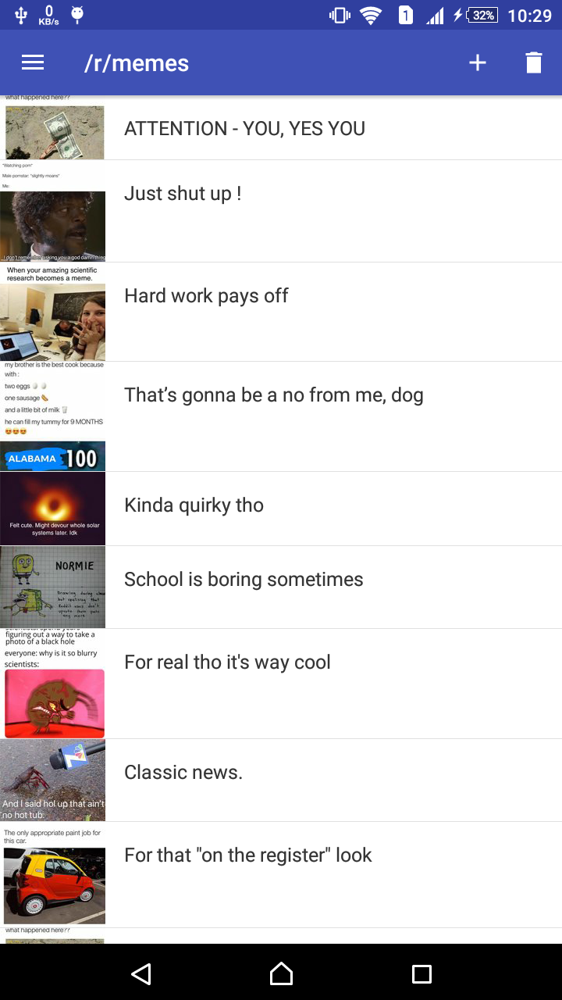
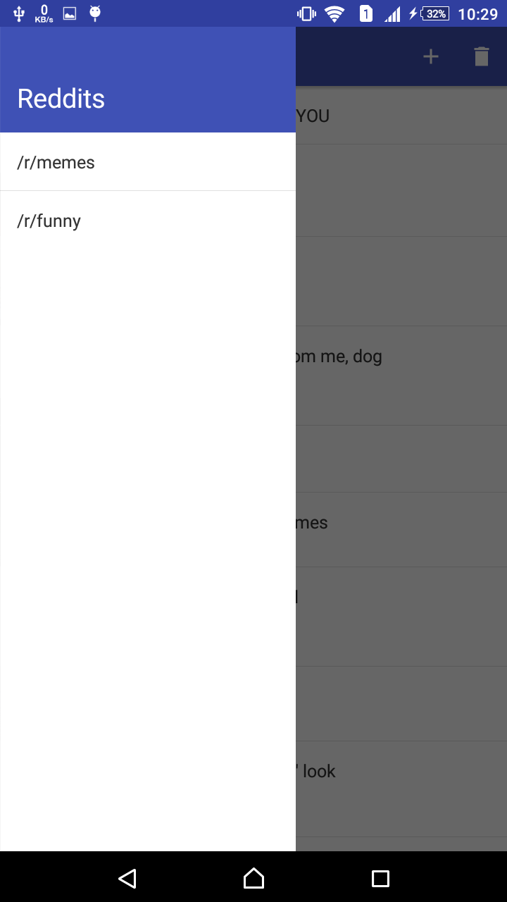
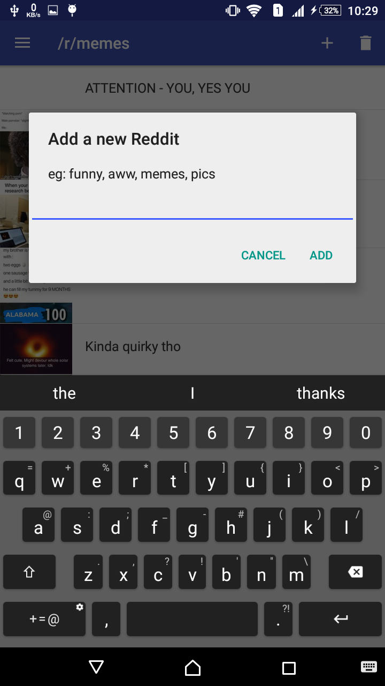

# NativeScript-Vue Application for Reddit

> A native application built with NativeScript-Vue.

## Usage

``` bash
# Install dependencies
npm install

# Build for production
tns build <platform> --bundle

# Build, watch for changes and debug the application
tns debug <platform> --bundle

# Build, watch for changes and run the application
tns run <platform> --bundle
```

# Screenshots






